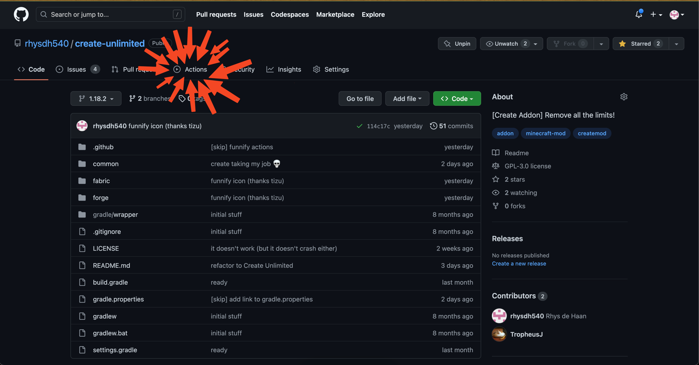
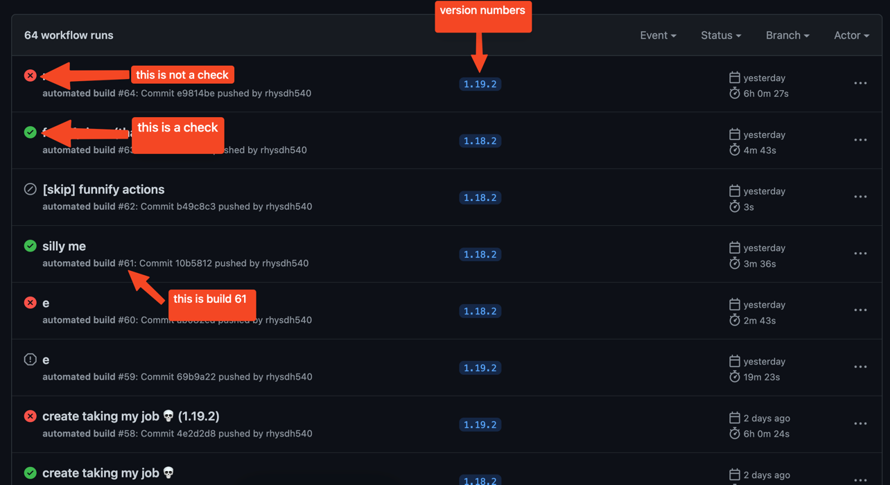
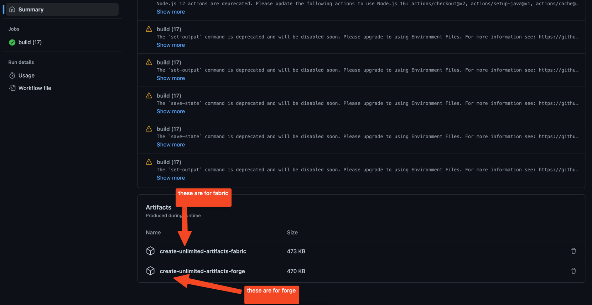
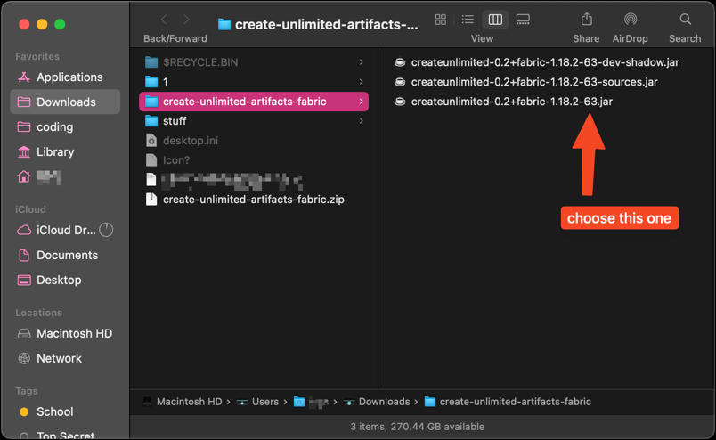

# Create Unlimited

This mod removes most of the limitations on various items and features of the Create mod.

### Current "Features":
- Remove train track placing limits
- 

It is **required** only on the server, but it is recommended that users install it on the client as well to take advantage of extra features.

credit to [tizu69](https://github.com/tizu69) for the original idea (and the icon).

### LATEST STABLE BUILDS:
These are confirmed to work and not crash, but can be outdated.
 - 1.18.2: Build **15**
 - 1.19.2: Build **19**

### How to install
First, click on the actions tab of this repository.

Then, either click on the latest workflow with a green check, or look for the specified stable build number above.

Scroll down to the bottom of the page and click on the artifacts for your modloader. Unzip this file.

Select the file that does not end with "sources" or "dev-shadow" and put that in your mods folder. 

